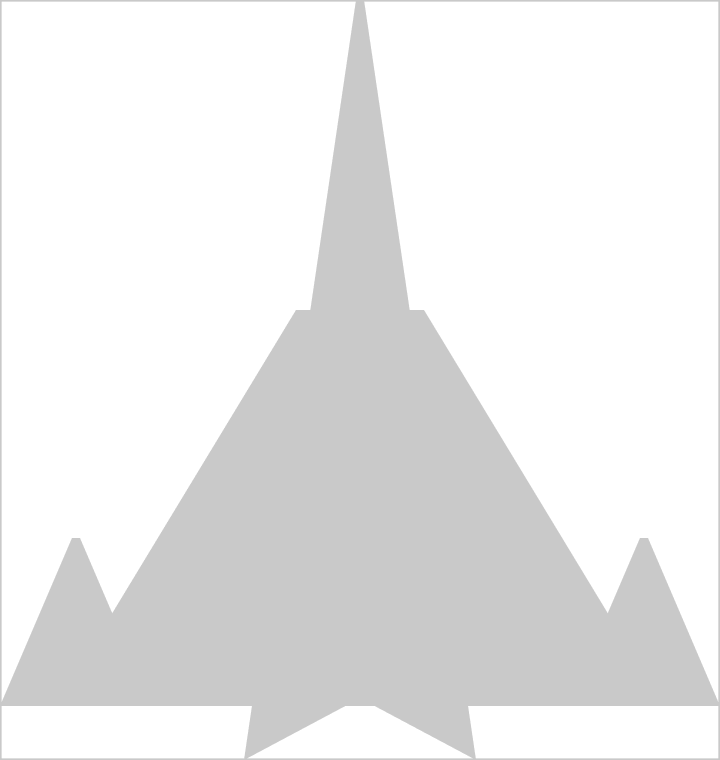

# Meu primeiro jogo (ever)

## Motivação

Durante minha gradução, sempre vi colegas fazendo coisas incríveis em [Python](python.org) e por contas das matérias acumuladas, nunca tive tempo para fazer.

Pois bem, já depois de formado e trabalhando, arranjei um tempo para fazer um projeto incrível em [Python](python.org). Dentre várias possibilidades, decidi fazer um jogo. Por quê? Eu já tinha estudado IA com [Python](python.org), eu já tinha aprendido o básico e intermediário da análise de dados e também já tinha feito um [projeto de banco de dados](https://github.com/alexandrenjr/trabalho-lbd) usando [SQLAlchemy](https://www.sqlalchemy.org/) e [Python](python.org).

Tendo isso em vista, gostaria de fazer algo diferente e um simples jogo era perfeito para isso. Além de reforçar meu conhecimento em [Python](python.org), com certeza aprenderia (e aprendi) coisas novas durante o desenvolvimento.

## O jogo

Sem mistérios e grandes expectativas: é um jogos simples de nave. Minha inspiração é um jogo que joguei no [Super Nintendo](https://pt.wikipedia.org/wiki/Super_Nintendo_Entertainment_System) chamado [Strike Gunner S.T.G.](https://pt.wikipedia.org/wiki/Strike_Gunner_S.T.G.). Obviamente que meu simples jogo não chega aos pés desse, mas pretendo adicionar novas funcionalidades para o projeto, principalmente novas armas, da mesma forma que o S.T.G. possuía.

### Desenvolvimento

O jogo foi feito usando o módulo [PyGame](https://www.pygame.org/), o que tornou o processo simples. Assim como já existia várias outras soluções em [Python](python.org), uma solução para jogos não ficaria de fora.

Inicialmente, estudei o módulo para saber como funciona. Como já tinha bastante noção de [programação orientada a objetos](https://pt.wikipedia.org/wiki/Programa%C3%A7%C3%A3o_orientada_a_objetos) (e ainda durante minha gradução tinha feito um trabalho usando [JavaFX](https://openjfx.io/)), saber como o [PyGame](https://www.pygame.org/) funciona foi relativamente simples. Basicamente segue a mesma ideia de cenas (ou superfícies, nesse caso) e objetos do [JavaFX](https://openjfx.io/).

Para não ir cru ao desenvolvimento, resolvi seguir um vídeo do [YouTube](https://www.youtube.com/). Acabei encontrado [esse](https://youtu.be/waY3LfJhQLY?si=qCE5bLjOWkpGs2zy), do [Tech with Tim](https://www.youtube.com/@TechWithTim), que me ajudou a entender esse processo.

Posteriormente, resolvi estender sozinho a aplicação, desenvolvendo lógicas mais complexas e também a brincar com sprites. Para isso, gostaria de trocar os retângulos básicos para formas mais complexas. Então, inicialmente, foquei na nave. Um colega de trabalho desenhou uma nave simples usando o [Figma](https://www.figma.com/pt-br/?context=confirmLocalePref). Acabei adotando a imagem por usar polígonos. Assim, eu poderia poderia desenhá-los "à mão". A imagem consistia em triângulos e trapézios.



Minha ideia para desenhar a nave com o [pygame.draw.polygon](https://www.pygame.org/docs/ref/draw.html#pygame.draw.polygon) era pegar as posiçoes relativas ao invés das absolutas. Fazendo isso, eu poderia aumentar ou diminuir a imagem sem perder a forma da nave.

## Tutorial de instalação

## Requisitos

- [git](https://git-scm.com/);
- [Python](python.org);
- [VSCode](https://code.visualstudio.com/) (recomendado), [PyCharm](https://www.jetbrains.com/pt-br/pycharm/) ou qualquer framework de sua preferência.

## Instalação

Clone este repositório:

```bash
git clone <https://github.com/alexandrenjr/meu-jogo.git>
```

> [!TIP]
> Se tiver usando o [VSCode](https://code.visualstudio.com/), basta clicar no botão _Controle de Código-Fonte (Source Control em ingês)_ e seguir passo a passo. Na pasta do projeto recém clonado, abra um terminal e crie um ambiente virtual no _Python_ com o seguinte comando:

```bash
python -m venv env
```

Ative tal ambiente:

```bash
env\Scripts\activate
```

Instale as dependências com o seguinte comando:

```bash
pip install -r requirements.txt
```

> [!TIP]
> Se tiver usando o [VSCode](https://code.visualstudio.com/), é só apertar `CTRL + Shift + P` e selecionar _Python: criar ambiente virtual_ e seguir o passo a passo.

## Executando a Aplicação

Execute a aplicação com:

```bash
python main.py
```

> [!TIP]
> Se tiver usando o [VSCode](https://code.visualstudio.com/), é só abrir o arquivo [main.py](main.py) e executar.
